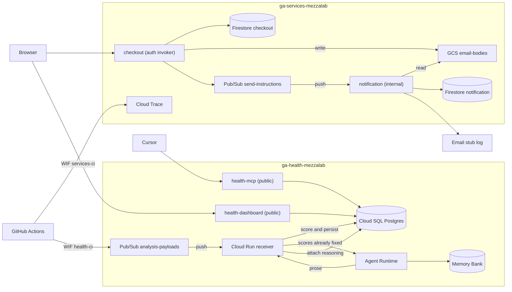

# Architectural health for an AI-accelerated migration

Two services carved out of a legacy monolith, plus a health system that scores whether the result still matches the intended architecture.

`docs/PRD.md` is the original specification. `docs/BUILD-SPEC.md` is the implementation contract (tree, payloads, schema, build order). `docs/SCORING.md` is the weight specification.

## What is real and what is not

Real: notification, checkout, inventory, and audit, their layering, Pub/Sub, Firestore, Postgres, the Cloud Run receiver, Agent Runtime, Memory Bank, the MCP server, the dashboard, ts-arch, dependency-cruiser, jscpd, Cloud Trace, the commit history, the scoring model, Terraform.

Illustrative: p95-latency, error-rate, and security signals. They arrive with `illustrative: true` and carry no weight. The runtime call graph is observed from synthetic smoke traffic and is also not scored.

## Deployed on GCP

Two projects in `europe-west1`. The dashboard and health MCP are public (`allUsers`). Checkout, inventory, notification, and the Cloud Run receiver require authenticated invokers (not `allUsers`). Agent Runtime runs Gemini 2.5 Pro under Agent Identity. Notification owns the email boundary; the cloud adapter uses a stub provider that logs `email.stubbed` rather than calling a real mail API.

Dashboard: https://health-dashboard-k3ljxa4a4q-ew.a.run.app
Checkout: https://checkout-iqcdekwluq-ew.a.run.app
MCP: https://health-mcp-k3ljxa4a4q-ew.a.run.app/mcp



GitHub Actions authenticates as `services-ci` in `ga-services-mezzalab` via the health project's Workload Identity pool, runs synthetic smoke against the live services, then collects. On `main` it publishes the payload to `analysis-payloads` as `health-ci`. The Cloud Run receiver validates that payload, scores it with `health/scoring`, and writes the run to Postgres. It then invokes Agent Runtime with those scores already fixed. The agent reasons, reads and writes Memory Bank, and returns prose. The receiver attaches that prose to the existing rows. MCP and the dashboard read Postgres. They never read Memory Bank. Images are in Artifact Registry (`health`, `services`). The receiver reads `health-database-url` and connects to Cloud SQL over a unix socket. The agent image has no database URL.

## Commands

```
pnpm install
pnpm test
docker compose up -d postgres
./scripts/replay.sh            # write the three history SHAs into Postgres
pnpm dashboard                 # http://localhost:4321
./scripts/dev-services.sh      # checkout :3000, notification :3001
```

Cursor loads the Cloud Run MCP from `.cursor/mcp.json` (`https://health-mcp-k3ljxa4a4q-ew.a.run.app/mcp`). Enable **architecture-health** under Cursor Settings → MCP. `list_health_runs` is the trend. `get_health` is the current (or SHA-specific) read.

Pay an order and inspect the process-local stub send list (`GET /sent` is in-memory on that notification instance; not available on the cloud image):

```
curl -sS -X POST http://127.0.0.1:3000/orders \
  -H 'content-type: application/json' \
  -d '{"id":"ord-1","email":"buyer@example.com"}'
curl -sS -X POST http://127.0.0.1:3000/orders/ord-1/pay
curl -sS http://127.0.0.1:3001/sent
```

Same loop as scripts, against local or the Cloud Run checkout URL (authenticated). Notification stays internal. Cloud outbox polling reads the notification Firestore `deliveries` doc with your `gcloud` credentials, not through checkout.

```
./scripts/demo-order.sh
./scripts/demo-outbox.sh
```

Locally, start `./scripts/dev-services.sh` first and set `CHECKOUT_URL=http://127.0.0.1:3000`. That script starts checkout and notification only. Local checkout uses `MemoryReservationPublisher`, which records `reserved` in-process so pay does not wait on inventory. On GCP, place publishes a reservation command and pay returns 409 `reservation not ready` until the outcome push lands (`demo-order.sh` retries). `demo-outbox.sh` then calls `GET /sent` on notification. On GCP, Pub/Sub pushes to notification (authenticated, not public) so a scaled-to-zero instance still wakes and writes the deliveries doc.

`GET /orders/:id` includes `reservationReady` so clients can poll before pay.

Cloud pay race and the 409 contract: place does not wait for inventory. Retry `POST /orders/:id/pay` until 200, or poll `reservationReady` on GET.

`pnpm arch`, `pnpm depcruise`, `pnpm jscpd`, and `pnpm collect` run the analysis tools and write an `AnalysisPayload`.

GCP Terraform lives in `infra/`. Do not apply it until a billing account exists. See `infra/README.md`.

Scoring runs on the Cloud Run receiver. `health/scoring` is not in the agent's image, so the agent cannot change a number. Local default is `HEALTH_REASONER=stub`. Set `adk` when credentials exist.

This README line is a collect probe. It does not change a scored signal.
