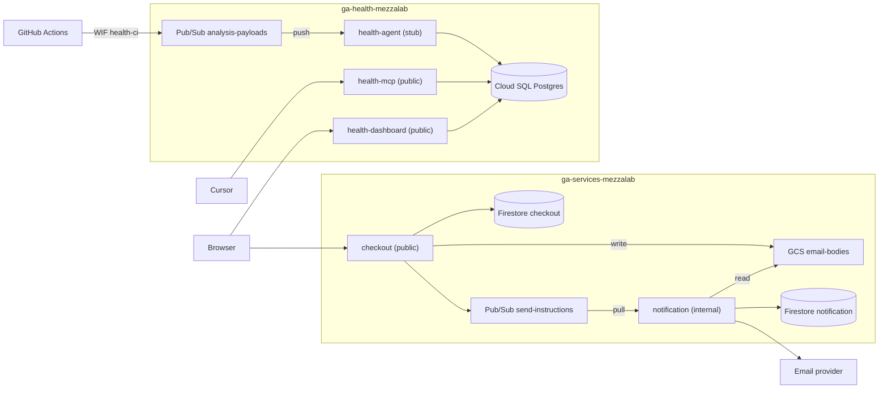

# Architectural health for an AI-accelerated migration

Two services carved out of a legacy monolith, plus a health system that scores whether the result still matches the intended architecture.

Read `docs/PRD.md` for what and why, `docs/BUILD-SPEC.md` for the tree, contracts, and build order.

## What is real and what is not

Real: notification and checkout, their layering, Pub/Sub, Firestore, Postgres, the health agent, Memory Bank, the MCP server, the dashboard, ts-arch, dependency-cruiser, jscpd, Cloud Trace, the commit history, the scoring model, Terraform.

Illustrative: runtime and security signals. They arrive with `illustrative: true` and carry no weight.

## Deployed on GCP

Two projects in `europe-west1`. Checkout, the dashboard, and the health MCP are public. Notification and the health agent stay internal. The health agent runs `HEALTH_REASONER=stub`. Only notification talks to the email provider.

Dashboard: https://health-dashboard-k3ljxa4a4q-ew.a.run.app
Checkout: https://checkout-iqcdekwluq-ew.a.run.app
MCP: https://health-mcp-k3ljxa4a4q-ew.a.run.app/mcp



GitHub Actions on `main` collects an `AnalysisPayload` and publishes it to `analysis-payloads` as `health-ci` via Workload Identity. The health agent writes the scored run to Postgres. MCP and the dashboard read that table. Images are in Artifact Registry (`health`, `services`). Health Cloud Run services read `health-database-url` and connect to Cloud SQL over a unix socket.

## Commands

```
pnpm install
pnpm test
docker compose up -d postgres
./scripts/replay.sh            # write the three history SHAs into Postgres
pnpm dashboard                 # http://localhost:4321
./scripts/dev-services.sh      # checkout :3000, notification :3001
```

Cursor loads the Cloud Run MCP from `.cursor/mcp.json` (`https://health-mcp-k3ljxa4a4q-ew.a.run.app/mcp`). Enable **architecture-health** under Cursor Settings → MCP. `list_health_runs` is the trend. `get_health` is the current (or SHA-specific) read.

Pay an order and inspect the in-memory send:

```
curl -sS -X POST http://127.0.0.1:3000/orders \
  -H 'content-type: application/json' \
  -d '{"id":"ord-1","email":"buyer@example.com"}'
curl -sS -X POST http://127.0.0.1:3000/orders/ord-1/pay
curl -sS http://127.0.0.1:3001/sent
```

Same loop as scripts, against local or the public checkout URL (default). Notification stays internal. Cloud outbox polling reads the notification Firestore `deliveries` doc with your `gcloud` credentials, not through checkout.

```
./scripts/demo-order.sh
./scripts/demo-outbox.sh
```

Locally, start `./scripts/dev-services.sh` first and set `CHECKOUT_URL=http://127.0.0.1:3000`. `demo-outbox.sh` then calls `GET /sent` on notification. On GCP, Pub/Sub pushes to notification (authenticated, not public) so a scaled-to-zero instance still wakes and writes the deliveries doc.

`pnpm arch`, `pnpm depcruise`, `pnpm jscpd`, and `pnpm collect` run the analysis tools and write an `AnalysisPayload`.

GCP Terraform lives in `infra/`. Do not apply it until a billing account exists. See `infra/README.md`.

The health agent never computes a score. Scores come from `health/scoring` and are deterministic. Local default is `HEALTH_REASONER=stub`. Set `adk` when credentials exist.
